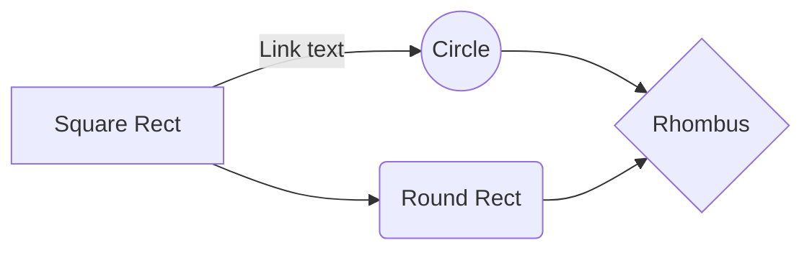

# What is KV Caching
During autoregressive decoding a decoder-only Transformer must compute, for every layer and every step $t$ 

```math
\begin{aligned}
Q_t = x_t W_Q, \\
K_t = x_t W_K, \\
V_t = x_t W_V, \\
\textit{Attention}(Q_t, K_{1:t}, V_{1:t}) &= \mathrm{softmax}\left(\frac{Q_t K^T_{1:t}}{\sqrt{d}}\right) V_{1:t}
\end{aligned}
```

**Note**: Only $Q_t$ involves the new token. The keys and values $K_{1:t-1}$, $V_{1:t-1}$ were already computed at earlier steps. KV-caching stores them once and simply appends $K_t$ and $V_t$

Without caching the per-token cost will be $O(t\times L \times d^2)$
With KV-cache it drops to $O(L \times d^2)$

## When and when not to use KV-Caching
When to use KV-Caching
1. Autoregressive token-by-token decoding
2. High perfmance inference
3. Long prompt and generated output use cases

When NOT to use KV-caching
1. Full Sequence processing in parallel (Non-autoregressive)
2. When the context changes frequently
3. Fine-Tuning or Traning 

## Tread-offs
KV-cache trades GPU memory for a drastic drop in per-token compute, enabling low-latency
for long-context LLM inference.



```mermaid
%%{init: {'theme':'default','logLevel':'fatal'}}%%
flowchart LR
    %% ─────────────────  column-wise layout  ─────────────────
    subgraph COL1[" "]  direction TB
        x1_lbl["X₁"]:::top
        x1_box([" "]):::sq
        bos(["[bos]"]):::bot
    end

    subgraph COL2[" "]  direction TB
        x2_lbl["X₂"]:::top
        x2_box([" "]):::sq
        stub2([" "]):::bot        %% invisible anchor
    end

    subgraph COL3[" "]  direction TB
        x3_lbl["X₃"]:::top
        x3_box([" "]):::sq
        stub3([" "]):::bot
    end

    subgraph COL4[" "]  direction TB
        eos_lbl["[eos]"]:::top
        eos_box([" "]):::sq
        stub4([" "]):::bot
    end

    %% ─────────────────  vertical feed arrows  ─────────────────
    bos      --> x1_box --> x1_lbl
    stub2    --> x2_box --> x2_lbl
    stub3    --> x3_box --> x3_lbl
    stub4    --> eos_box --> eos_lbl

    %% ─────────────────  curved loop-back arrows  ─────────────────
    x1_box -.-> x2_box
    x2_box -.-> x3_box
    x3_box -.-> eos_box

    %% ─────────────────  styling  ─────────────────
    classDef sq  fill:#f8baba,stroke:#000;
    classDef top fill:#ffffff,stroke:#000,stroke-dasharray:4 3;
    classDef bot fill:#ffffff,stroke:#000,stroke-width:0;

```


