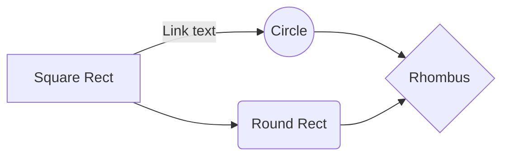

# What is KV Caching
During autoregressive decoding a decoder-only Transformer must compute, for every layer and every step $t$ 

```math
\begin{aligned}
Q_t = x_t W_Q, \\
K_t = x_t W_K, \\
V_t = x_t W_V, \\
\textit{Attention}(Q_t, K_{1:t}, V_{1:t}) &= \mathrm{softmax}\left(\frac{Q_t K^T_{1:t}}{\sqrt{d}}\right) V_{1:t}
\end{aligned}
```

**Note**: Only $Q_t$ involves the new token. The keys and values $K_{1:t-1}$, $V_{1:t-1}$ were already computed at earlier steps. KV-caching stores them once and simply appends $K_t$ and $V_t$

Without caching the per-token cost will be $O(t\times L \times d^2)$
With KV-cache it drops to $O(L \times d^2)$

## When and when not to use KV-Caching
When to use KV-Caching
1. Autoregressive token-by-token decoding
2. High perfmance inference
3. Long prompt and generated output use cases

When NOT to use KV-caching
1. Full Sequence processing in parallel (Non-autoregressive)
2. When the context changes frequently
3. Fine-Tuning or Traning 

## Tread-offs
KV-cache trades GPU memory for a drastic drop in per-token compute, enabling low-latency
for long-context LLM inference.



```mermaid
%%{init: {'theme':'default','logLevel':'fatal'}}%%
flowchart LR
    %% ───────────  layout  ───────────
    direction TB
    subgraph S[" "]   %% keeps the blocks in one row
        direction LR
        %% token columns (label on top, square below)
        subgraph C1[" "]  direction TB
            xl1["X₁"]:::lbl
            x1([" "]):::tok
        end
        subgraph C2[" "]  direction TB
            xl2["X₂"]:::lbl
            x2([" "]):::tok
        end
        subgraph C3[" "]  direction TB
            xl3["X₃"]:::lbl
            x3([" "]):::tok
        end
        subgraph C4[" "]  direction TB
            xle["[eos]"]:::lbl
            xe([" "]):::tok
        end
    end

    %% ───────────  arrows  ───────────
    bos(["[bos]"]):::lbl
    bos --> x1                      %% teacher-forcing feed
    x1 --> x2
    x2 --> x3
    x3 --> xe

    %% dotted “feedback” arrows (curved look-alikes)
    x1 -.-> x2
    x2 -.-> x3
    x3 -.-> xe

    %% ───────────  styles  ───────────
    classDef tok  fill:#f8baba,stroke:#000;
    classDef lbl  fill:#ffffff,stroke:#000,stroke-dasharray:4 3;
```


